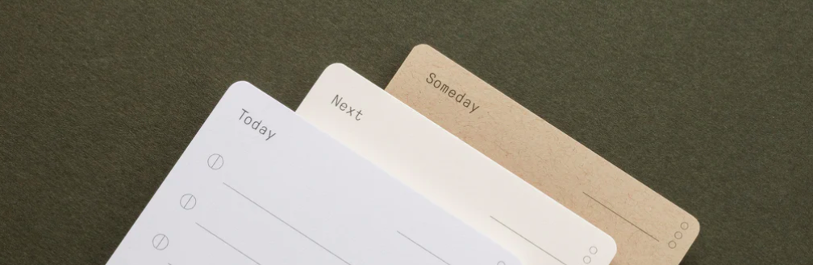

# Analog Todo App

## What’s This Project?

Managing work, life, and projects can be overwhelming. Traditional to-do lists often fail to keep users motivated and organized. This app aims to provide a more intuitive and goal-oriented approach to task management, inspired by analog design principles. It helps users structure daily tasks and long-term goals effectively.

---

## The Problem

Regular to-do lists are great for jotting down tasks but terrible at:

- Helping you stick with your goals.
- Prioritizing what actually matters.
- Keeping you motivated to follow through.

They often become cluttered or neglected, making them more stressful than helpful.

---

## The Solution

I built a **minimalist to-do app** inspired by analog task cards to help create a natural flow for:

- **Planning**: Start each day with a focused list of tasks.
- **Execution**: Track progress throughout the day.
- **Reflection**: Review productivity and carry over unfinished tasks.

The app keeps things simple but structured, encouraging steady progress over time.

---

## Key Features

### Card-Based Workflow

- **Today**: Jot down up to 10 tasks to focus on for the day. Update their status as you go.
- **Next**: Capture important tasks that need attention soon but not today.
- **Someday**: Store long-term goals, ideas, and dreams for the future.

### Task Signals

Mark task statuses with these icons:

- **( X )** Completed
- **( | )** In Progress
- **( > )** Delegated
- **( - )** Appointment

### Daily & Weekly Reviews

- Reflect on your daily progress and rate your productivity.
- Move unfinished tasks to the next day or another card.
- Review weekly goals to stay on track.

### Export & Sync

- Easily export your task data to sync across devices.

---

## How to Run the App

```
git clone https://github.com/your-repo/analog-todo-app.git
cd analog-todo-app
npm install -g http-server
http-server
```

Go to [http://127.0.0.1:8080/](http://127.0.0.1:8080/) in your browser.

---

## Under the Hood

This app is built with a minimalist approach, leveraging modern web technologies for optimal performance and user experience:

- **Vanilla JavaScript**: Developed using pure JavaScript for enhanced performance and maintainability, avoiding heavy frameworks.

- **IndexedDB**: Utilizes IndexedDB for efficient local data storage, enabling offline access to tasks.

- **Advanced CSS Techniques**: Employs Flexbox, media queries, transitions, pseudo-classes/elements, scalable SVGs, drop shadows, responsive units, accessibility features, and advanced selectors for a responsive and interactive design.

- **Progressive Web App (PWA)**: Designed as a PWA, offering offline support, fast loading times, and the ability to be installed on users' devices.

- **Modular Architecture**: Organized into modular components, promoting reusability and ease of scaling.

By focusing on these technical choices, the Analog Todo App combines functionality with a clean, intuitive design, demonstrating a commitment to best practices in software development.

---

### V1: General Functionality

- Goal: track weekly goal and set calendar reminder for daily checkins
- Calendar: Overview of progress and quick nav
- Todo: track todays tasks
- Next: track upcoming tasks
- Someday: track longer term tasks and goals

---

- Info: How to use the tool
- Export: Sync data between two devices
- Coach: AI Agent to help define goals and break down tasks

---

## Why This Project?

I wanted to build something practical for managing the chaos of daily life and work while still being simple and motivating. This app reflects my design process and how I approach solving real-world productivity problems. It might also inspire others working on team collaboration or personal productivity tools.

---

## Feedback?

I’m always open to feedback or new ideas! If this sparks something for your own projects or you have suggestions, feel free to open an issue or reach out.

---
