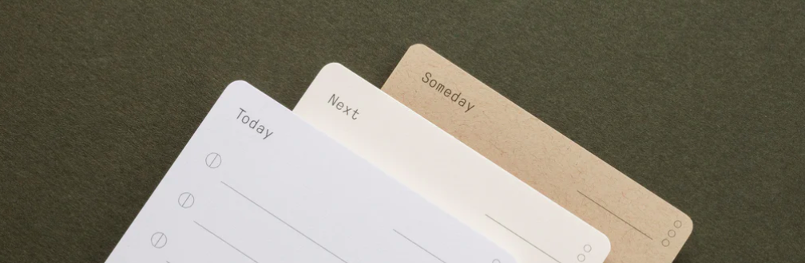

#### Summary:
Managing a number of competing priorities between work and life becomes overwhelming over time. 
When tasked to manage other people's projects and peoples career growth the process becomes unmanagable without proper tools.
There are a number of tools on the market but none of them focus on making the process stick.
The time to organize the todo list, reflect on what needs to be done and the motivation to keep on is usually neglected.
Add triggers to move the user into the right direction and keep them motivated to reach some of their long term goals.

#### Problem: Todo lists by themselves are ineffective for setting and maintaining goals. 

#### Solution: Create a habit forming cadence for planning, prioritization, execution and retrospection.

- Create a minimalistic todo app based on the following design:
[analog todo cards](https://ugmonk.com/blogs/journal/analog-the-simplest-productivity-system)
- Create supplimental workflows to plan and review todo list for the day.
[analog todo card app](https://bmardock.github.io/analog-todo)

## V1. Using the task list:
```
Card layout
Top Left Card type (Today, Next, Someday)
Top right date
Top right card signal ⋮
Bullet list of tasks (10)
( ) __________________
Left bullet item signal icons
( X ) Complete
( | ) In progress
( > ) Delegated
( - ) Appointment
```

#### Today
At the beginning of each day, write up to 10 tasks on a Today card.
During the day update each item with the status moving it to complete

After the day carry over remaining tasks to next day or move to diff card
At the end of the day use the Card Signal to rate your productivity for the day

#### Next (month)
Record important tasks that need to be done, but not today.
Use this list to help you fill out your Today cards.

#### Someday (year)
Capture ideas, aspirations, and goals that you would like to accomplish someday.

##### Tasks:
- Create an up to date task list for today 
- Update task signals throughout the day
- End of day Review days progress
- Carry over incomplete tasks
- Review the weeks progress


## V2. Setting time
- Capture short, mid and long term goals for a new user
- Set aside focus time in the day for organizing todays list and reflection
- During task focus time keep list readily available and limit distractions
- Highlight progress to keep user motivated

## V3. Meaningful tasks
- Utilize time management strategies to set productivity [MIT](https://www.calendar.com/blog/mit-time-management-strategy/)
- Defining a tasks [4 quadrant](https://appfluence.com/productivity/time-management-strategies-for-busy-people-using-the-4-quadrant-method/) 
  (Critical due soon, Critical due later, Not critical, Uncategorized

## V4. Task Assistant
- Add an interface for a chatbot to assist user in defining and accomplishing goals.
- Set reminders, create tasks for user based on conversation.
